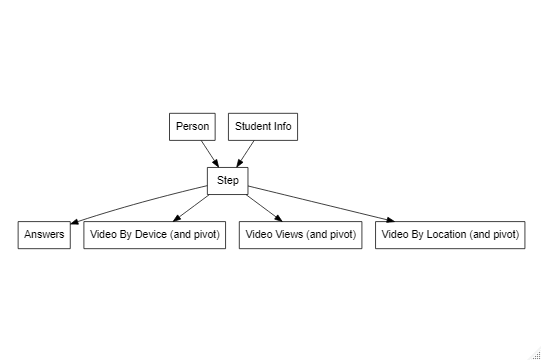

```{r setup, include=FALSE}
knitr::opts_chunk$set(echo = TRUE)
knitr::opts_knit$set(root.dir=normalizePath('..'))
```

```{r loadproject, include=FALSE}
library(ProjectTemplate); load.project()
```

## CSC 8631 - Data Management and Exploratory Data Analysis
An investigation into an MDOC dataset using a CRISP-DM model. The model is the industry standard approach to data mining projects, it has six phases and is iterative. It is described as a "set of guardrails to help you plan organise and implement your data science (or machine learning) project."(Data Science Alliance, 2021).

The phases and tasks of a CRISP-DM project are outlined by the Data Science Alliance as per:

1. Business Understanding - what does the business need?
  + Understand the business objective. What does the customer want to accomplish? 
  + Assess the situation. Determine resource availability, requirements, risks and contingencies
  + Data Mining Goals - what does success look like?
  
2. Data Understanding - what data do we have / need? Identify, collect and analyse.
  + Collect the initial data, acquire and load into data analysis tool.
  + Describe the data, examine and document properties such as data format, number of records and identities
  + Explore the data, query and visualise and identify the relationships.
  + Verify the data quality and document any issues.
  
3. Data Preparation - prepare the final data sets for modelling.
  + Determine which data set to be used and reasons for inclusion / exclusion.
  + Clean the data
  + Construct data, carry out any required feature engineering.
  + Integrate data, create new data sets by combining data sources
  + Re-format data as necessary, cast data types as required.

4. Modelling - what modelling techniques should we apply?
  + Determine which models to try.
  + Design tests.
  + Build and assess the model.
  
5. Evaluation - which model best meets the business objectives?
  + Evaluate the models against the business success criteria identified in step 1.
  + Review the processes, was anything overlooked and everything properly executed?
  + Determine next steps, what do we need to do to deploy.
 
6. Deployment - how do stakeholders access the results?
  + Plan deployment, document.
  + Plan monitoring and maintenance.
  + Produce the final report.

This report will cover the first three steps of this model and a minimum of two iterations. I will attempt to implement all of the associated tasks. With the lack of formal requirements provided by the assignment it will be difficult to define a business need in the first iteration of the model therefore tasks such as defining the business objective and data mining goals will be defined for the second iteration as a result of the first. So, each therefore the two iterations of the model will be:

1. Iteration 1
  + Data Understanding
  + Data Preparation
  
2. Iteration 2
  + Business Understanding - define and understand the hypothesis from Iteration 1.
  + Data Understanding
  + Data Preparation.

The investigative project will be completed in R using R Studio and has been set up using ProjectTemplate to provide structure and repeatability. Version control is provided by Git and this report created with R Markdown. Various libraries have been imported and used from the Tidyverse regarding data import and management (Dplyr, Readr) and visualisation (GGPlot2).

### Iteration 1
A first iteration completing the understanding and preparation step will be carried out. The Future Learn MDOC dataset was downloaded as a zip file and reviewed. The data was supplied in csv files covering 8 different areas of the software over multiple stages, this was imported into R into 8 data frames from the original for easier analysis. The data was then reviewed.

#### Step 2: Data Understanding

Upon initial import is was found that the detected data types were not consistent and so his was dynamically set on import. Particularly any ID property was set to be an integer and date time properties we converted to the local POSIX time format. 

Upon investigation it was decided that some data would be disregarded due to lack of breath. Therefore, we have data covering the life cycle of a student including:


* **Enrollments**. Enrollment is a categorical dataset with n=37296 items and p=14 variables. It was found that the majority of data for all properties was "unknown" and therefore not suitable for further analysis. 

  * __Candidate Keys__ - "Learner_ID" of character data type.
  
  * __Fields and data types__ - Properties include Country, Gender, Age Range, Highest Education Achieved, Employment Area and Employment Status, Role all of type character. Also date / time of enrolled, un-enrolled, fully participated and purchased statements.
  
  * __Related data sets__ - Team Member, Leaving Survey and Step Activity can be related on Learner_ID
  
  * __Data Quality__ - The data types across date times in multiple files were inconsistent and therefore they were cast on import. The vast majority of data for each categorical value is "Unknown". Once the data was imported a basic type and missingness check was carried out. This showed type failures of 1 record on each of the date fields (enrolled, unenrolled, fully participated and purchased statement), there were also significant gaps in the same date based data, between 35k and 37k records. However, there were no issues with the categorical data. This was then plotted to investigate the data as shown in Figure 1 "Categorical Enrollment Data".
  
``` {r EnrollmentPlots, echo=FALSE, out.width="100%", fig.cap="Categorical Enrollment Data"}
#graph the enrollment data
par(mfrow=c(2,3))

#country
countryData = dfE %>%
  group_by(country) %>%
  count(dfE$country) #do a count
countryData = filter(countryData, n > 100) #filter only where greater than 100
countryData = select(countryData, country, n) #select the correct cols
barplot(countryData$n, main="Country",
        names.arg = c("Australia", 'GB', "India", "Nigeria", "Unknown", "US")
        , xlab = "Country"
        , ylab="Count of Enrollments")
#pie(countryData$n, labels = countryData$country, main="Enrollments by country greater than 10")

#gender
genderData = dfE %>%
  group_by(gender) %>%
  count(dfE$gender)
genderData = select(genderData, gender, n)
barplot(genderData$n, main="Gender",
        names.arg = c("Female", 'Male', "Nonbinary", "Other", "Unknown")
        , xlab = "Gender"
        , ylab="Count of Enrollments")

#age range
agerangeData = dfE %>%
  group_by(age_range) %>%
  count(dfE$age_range)
agerangeData = select(agerangeData, age_range, n)
barplot(agerangeData$n, main="Age Range",
        names.arg = c("<18", ">65", "18-25", "26-35", "36-45", "46-55", "56-65","Unknown")
        , xlab = "Age Range"
        , ylab="Count of Enrollments")

#highest_education_level
highestEducationData = dfE %>%
  group_by(highest_education_level) %>%
  count(dfE$highest_education_level)
highestEducationData = select(highestEducationData, highest_education_level, n)
barplot(highestEducationData$n, main="Highest Education",
        names.arg = c("Apprenticeship", "<Secondary", "Professional", "Secondary", "Tertiary", "Degree", "Doctrate", "Masters", "Unknown")
        , xlab = "Highest Educational Level"
        , ylab="Count of Enrollments")

#employment area
employmentareaData = dfE %>%
  group_by(employment_area) %>%
  count(dfE$employment_area)
employmentareaData = select(employmentareaData, employment_area, n)
barplot(employmentareaData$n, main="Employment Area",
        names.arg = employmentareaData$employment_area
        , xlab = "Employment Area"
        , ylab="Count of Enrollments")

#employment area
employmentstatusData = dfE %>%
  group_by(employment_status) %>%
  count(dfE$employment_status)
employmentstatusData = select(employmentstatusData, employment_status, n)
barplot(employmentstatusData$n, main="Employment Status",
        names.arg = employmentstatusData$employment_status
        , xlab = "Employment Status"
        , ylab="Count of Enrollments")

par(mfrow=c(1,1))
```

  It can be seen that the majority of the data for the categorical data fields is         "unknown" and therefore not suitable for further analysis.


* **Step Activity**. This indicates the stage in the course that the related data occurred at. It is principally categorical data with n=423072 items and p=6 variables.

  * __Candidate Keys__ - A compound key of "Learner_ID" of character data type and step (integer). This identifies data about the step the student was at.

  * __Fields and data types__ - "Learner_ID" of type character, "week_number" and "step_number" both of which are integer and "step" which is also an integer and is a concatenation of the two. "First_Visited_At" and "Last_Completed_At" are both date times and indicate when the student was at that stage.

  * __Related data sets__ - Enrollments via "Learner ID", Question Response, Video Stats and Sentiment Survey via Step. Each step in the step activity data frame has associated quiz questions and responses.

  * __Data Quality__ - Data types were consistent across the files to be imported. Date times were cast on import. Basic data quality checks indicate that "First_Visited_At" and "Last_Completed_At" are natively characters and so they were cast to date times. Significant gaps were observed on "last_completed_at" which may be correct.
  
  
* **Leaving Survey**. The leaving survey responses comprises of categorical, character and date based data regarding feedback from individuals which have left the course. The data frame has n=403 items and p=10 variables. The primary key of this table is ID which was cast to an integer in the import process.

  * __Candidate Keys__ - "ID" which was cast to integer during import.
  
  * __Fields and data types__ - "ID" as integer, "Learner_ID" as character, "Left_at" as datetime, the date and time a student left the course, "leaving_reason" as characters, "last_completed_step" as character and "last_completed_step" as as date time, also the "last_completed_week_number" and "last_completed_step_number".
  
  * __Related data sets__ - Enrollments on "Learner_ID". Investigation into the key fields of "last_completed_step", "last_completed_step_number" and "last_completed_week_number" revealed that "last_completed_step" was a concatenation of the other two fields and could be used to relate to the Step Activity data. This allows the identification of the stage that students leave the course. This can be seen below.
  
  ```{r enrollmentsToStep, echo=FALSE, out.width="65%", fig.cap="Enrollment to Step Activity Keys"}
  dfLSR = dfLSR %>% filter(!is.na(last_completed_step))
  select(dfLSR, last_completed_step, last_completed_step_number, 
       last_completed_week_number)[1:5,]
  ```
  
  * __Data Quality__ - Upon import it was necessary to standardise the data type across multiple files, id was cast to integer, last completed step to character and the last completed step and week numbers to integer. All date times were also cast to date time. Upon investigation of the data it was found that there were multiple leaving reasons which amounted to "lack of time" (Figure 1), this field was merged to make it comparable to other values (Figure 2)
  
  ```{r reasonsForLeaving, echo=FALSE, out.width="75%", fig.cap="Native Reasons for Leaving"}
    table(dfLSR$leaving_reason)
  ```
  Once corrected the data is comparable as per below.
  
  ```{r reasonsForLeavingEngineered, echo=FALSE, out.width="75%", fig.cap="Engineered Reasons for Leaving"}
    barplot(table(dfLSR$reason)
          , main="Reasons for Leaving"
          , xlab="Reason"
          , ylab="Count of Leavers")
  ```
  
* **Question Responses**. Each step in the step activity data frame has associated quiz questions and responses. This is stored in the questions data frame. The question responses data is categorical data with n=176463 items and p=10 variables.

  * __Candidate Keys__ - "Learner_ID" of character data type and quiz_question which is a concatenation of week_number, step_number and question_number. By concatenating just the week_number and step_number we are able to calculate the question step and relate to the Step Activity data set.

  * __Fields and data types__ - Other properties outside of the keys are "question_type" which is exclusively "MultipleChoice", response of character which is the answer to the question, cloze_response which is always NA, submitted_at which is a datetime of the submitted at date and correct which is a boolean. This would give us access to the scores of each student

  * __Related data sets__ - Some feature engineering would allow us to relate to the Step Activity data set and the learner_id allows us to relate to the Enrollments data set and any associated Leaving Surveys.

  * __Data Quality__ - Simple data quality checks were carried out which showed the correct data types, and that Cloze_Response is always null. A review of week_number, step_number and question_number confirmed that they could be concatenated to form the tables primary key and a step key, as per Figure 4 below, "Question Response Key Construct".
    
```{r qrKeys, echo=FALSE, out.width="75%", fig.cap="Question Response Key Construct"}
dfQRNumbers <- select(dfQR, quiz_question, week_number, step_number, question_number)
dfQRNumbers <- group_by(dfQRNumbers)
dfQRNumbers <- dfQRNumbers %>%
  group_by(quiz_question)
unique(dfQRNumbers)
```
It can be clearly seen that concatenating the columns gives us the key.


* **Video Views**. Each step in the step activity data frame also has associated video view data. The video stats data is multivariate data with n=65 items and p=29 variables. There are significantly more data variables in this relation then in those examined previously, and significantly less data items. 

  * __Candidate Keys__ - "Step_Position" identifies the videos position within in the course as a whole and could be related to Step Activity. This along with the video title would uniquely identify he video and the rest of the data in the data set is already grouped.

  * __Fields and type__ - All of the fields in this dataset other than "title" are categorical and are integers. The data in this relation can be subsetted into data pertaining to percentage complete, type of device and location of the video view which allows investigation of each specific facet. This will be revisited at the data preparation stage if required.

  * __Related data sets__ -The step_position allows us to relate to step_activity which allows relationships through the rest of the dataset.

  * __Data Quality__ - Data quality checks for type and missingness did not raise any issues. Upon investigation, the table is wide, it will be necessary to pivot to see any meaningful data. Also the data is expressed as percentages, to make the data comparable it will be necessary to convert to absolute numbers, and compare back to total_views.


* **Weekly Sentiments**. This is completed by each student per week. The sentiment data has n=181 items and p=6 variables. This table has a categorical properly rating and character data to cover the sentiment. I will not be looking to cover sentiment analysis in this work so only the categorical value will be looked at. 

  * __Candidate Keys__ - "ID" has been cast to integer during the import process, other than week_number i do not see a key to create a relationship into the wider data set.

  * __Fields and data types__ - "Experience_rating" is an integer between 1 and 3 which gives the rating of the student for that week. "Week_number" is the number for the week between 1 and 3 and "reason" is a character string to justify the experience_rating.

  * __Related data sets__ - None

  * __Data Quality__ - ID, Week number and experience rating were cast to integer on import to standardise the data type across multiple data sets. Responded at was also cast from character to date time. Data quality checks revealed correct data types, and reason being missing in 111 cases from 181. There would be value in converting this data to percentages.


The relationships between data sets as discussed above are documented below.

{width=75%}

#### Data Preparation
Each set of data was imported into a dataframe during the data understanding stage. This was done by filtering the file set and reading the contents of each file to a list. This was then bound by Dplyr. The example below binds all *question.response.csv files into a dataframe.

```{r importFiles, echo=TRUE, results='hide'}
  #working files
  files = list.files(pattern="*question.response.csv")

  datalist = lapply(files, function(i){
    csv <- read_csv(i, show_col_types = FALSE)
    csv$stage_id <- substring(i,16,16)
    csv
  })
  dfQR <-dplyr::bind_rows(datalist)
```

As we still do not have a clear business objective in this first iteration, the data preparation stage will be used to implement any data changes to make a more completed and integrated dataset. The changes implemented here may or may not be required in the analysis carried out in iteration 2, they have merely been observed while carrying out the steps during the data understanding process. Processes such as re-formatting and casting the data have already been carried out in the data understanding step to successfully merge multiple CSV files into one data frame.

Particularly, it was identified that some feature engineering could be carried out to prepare the data for further analysis. These fixes were implemented in the munge process. Particularly:

* __Step Activity__, this dataset has the step start and end date, some data engineers was completed to add an "isComplete" flag to the dataset, as well as a "completedTime" integer indicating the difference between the start and end date of the step. 

  * An isComplete flag was added by checking the last_completed_at date for NA. 
  ```{r isComplete, echo=TRUE, results='hide'}
    dfSA$isComplete = !is.na(dfSA$last_completed_at) 
  ```
  * A time to complete count in days was added by subtracting the start date from the end date.
  ```{r timeToComplete, echo=TRUE, results='hide'}
  dfSA$timeToComplete = difftime(dfSA$last_completed_at, dfSA$first_visited_at, 
                               units="days") #calculate the difference
  ```

* Question Responses, it was identified that while the dataset is missing the step column to relate the Step Activity table, this can be created from data which is present. This allows us to integrate responses to steps and to the wider dataset.

  * The quiz_question key was split on . to a list. SApply was then used to concatenate the first two elements together split by a dot. This was then added to the dataset.
  
  * Dplyr was then used to prove a left join between the question responses and step activity data sets.

* Video Views, it was identified that this dataset has a logical collection of three types of data and could be split into three data sets, it was all observed that a pivoted data set would be required for analysis and the conversion of data from "percentages of percentages" to absolute counts.

  * Splitting out the child dataset was carried out by taking a slice of the original dataset.
    ```{r sliceVideoViews, echo=TRUE, results='hide'}
    dfVSTotals = dfVS[,c(1,2,4, 9:15)]
    ```
  * The data frame was then extended by adding the appropriate properties. In this example a helper function was used to express the percent as raw numbers..
  
  ```{r createAdditionalProperties, echo=true, results='hide'}
    dfVSTotals$"05" = as.percent(dfVSTotals$total_views, dfVSTotals$viewed_five_percent)
    dfVSTotals$"10" = as.percent(dfVSTotals$total_views, dfVSTotals$viewed_ten_percent)
    dfVSTotals$"25" = as.percent(dfVSTotals$total_views, dfVSTotals$viewed_twentyfive_percent)
    dfVSTotals$"50" = as.percent(dfVSTotals$total_views, dfVSTotals$viewed_fifty_percent)
    dfVSTotals$"75" = as.percent(dfVSTotals$total_views, dfVSTotals$viewed_seventyfive_percent)
    dfVSTotals$"95" = as.percent(dfVSTotals$total_views, dfVSTotals$viewed_ninetyfive_percent)
    dfVSTotals$"99" = as.percent(dfVSTotals$total_views, dfVSTotals$viewed_onehundred_percent)
  
  ```
  * The result was then selected using Dplry to produce a neater table. A pivoted table was then created to support reporting. The figure below shows the transformed data in a logical structure for reporting. This was carried out for all three data sets.
  
  ```{r createPivot, echo=TRUE, results='hide'}
      dfVSTotals = select(dfVSTotals, step_position, title, "05", "10", "25", "50", "75", "95", "99")
    dfVSTotalsPivot = dfVSTotals %>% 
      pivot_longer(!(1:2), names_to = "percentviewed", values_to = "count") #createpivot
  ```

  The formatted data for reporting is as per below.

  ```{r pivottedViews, echo=FALSE, out.width="75%", fig.cap="Tranformed Video View Data"}
   dfVSTotalsPivot
  ```

\newpage
### Iteration 2
Throughout iteration 1 a hypothesis to investigate has not become clear.

#### Business Understanding
The dataset it principally a collection of categorical data which could be investigated of which nothing leaps out at this time. I suggest that the objective to accomplish to to amass a greater understanding of the data and success looks like some interesting avenues to investigate.A hypothesis may become clearer during the data understanding and preparation phases.

A successful project would outline more than one avenue for further exploration with an indication of what may be found. Continuous data is available via the Video View data which may be of further interest to investigate from a complexity point of view. 

The risks of such an approach are that nothing leaps out of interest or for further analysis. However, this is a valuable finding in itself.

#### Data Understanding
To support the this iteration I felt that I needed to review the data sources and further investigate the structure. It was found that the Archetype and Team Member data sets which had been missed in iteration 1. Upon further investigation it was found that they relate to Enrollment on Learner_ID on a 1 to 1 basis. Therefore I have merged the Team Member, Archetype and Enrollment data sets to create separate Person and Student Info data sets, these are related on Learner_ID. 

```{r enrollmentTransforms, echo=true, results='hide'}
#create dfStudent and person from enrollments, archetypes, team members
dfStudent <- left_join(dfE, dfAR, by = c("learner_id" = "learner_id")) #enrollment
dfStudentTM <- left_join(dfStudent, dfTM, by = c("learner_id" = "learner_id")) #team member
dfStudentLeavers <- left_join(dfStudentTM, dfLSR, by = c("learner_id" = "learner_id")) #leavers
dfStudentLeavers$left = !is.na(dfStudentLeavers$last_completed_step) #set leaver flag
```

This gave me a complete dataset regarding the students which I subsequently split into Student Info and Person data sets, I also flagged any leavers to allow this to be easily visualised.

```{r enrollmentSplit, echo=true, results='hide'}
#select out two tables
dfStudentInfo = select(dfStudentLeavers, learner_id, enrolled_at, unenrolled_at,
                  fully_participated_at, purchased_statement_at, 
                  archetype, role, team_role, user_role)

dfPerson = select(dfStudentLeavers, learner_id, gender, country, age_range, 
                   highest_education_level, employment_status, employment_area,
                   detected_country, left)
```

Person contains details about the person including age, age_range, education level. Student Info contains student centric information such as enrollment dates and various roles, archetypes etc. I have also slimmed down the Step and Answers data sets. 

```{r slimStepAnswers, echo=FALSE, out.width="75%", fig.cap="Step and Answers Data"}
#steps
head(dfStep)

#answers
head(dfAnswers)

```

We are now left with the following structure which I am confident can be correctly queried.

{width=75%}

These transformations were subsequently loaded into the analysis tool, and an extra step was added to the munge process to handle these transformations.

\newpage
__People and Students__
My initial investigation queried the categorical data regarding people and students. Each categorical item was plotted on a bar chart with "Unknown" removed to give allow a reasonable view on the rest of the data. As identified in iteration 1 unknown makes up the vast quantity of this data. Students split by gender is roughly a 50 / 50 split, country offers GB as the clear leader where the data is known, age range offers 26-35 as the most common group, but get a general spread over all range other than under 18. So far so predictable. The only clear outliers to give any kind of insight into the type of student attracted is:

* Highest education = University degree
* Employment Status = Working full time
* Employment area = IT and Information Services

Detected country also found GB to do the most common value after Unknown. However, students would travel to take part in their course so this may be artificially bloated. So we have learned that individuals taking a cyber security course generally work in IT, full time, and the gateway to such a career is a university degree.

Of potential more interest in the multiple roles for each student. We can see that there is a clear number of vitalisers over the other archetypes, and very few flourishes and hobbyists. This is shown in the figure below.

```{r studentsBy, echo=FALSE, out.width="100%", fig.cap="Student by Archetype and Team Role"}
plot1 <- plot.enrollment(dfStudentInfo[,c(1,6)], 'archetype') #archetype
plot2 <- plot.enrollment(dfStudentInfo[,c(1,8)], 'team_role') 
grid.arrange(plot1, plot2, ncol=2)

```

The vast majority of students on the course are learners rather than admins and the team roles reflect educator and host being the team roles.  Those don't particularly sound like student roles and the  trifling numbers in each role could also reflect this. Some investigation of archetype vs team roles in further iterations could be of interest.

\newpage
__Course Progress__
I adopted the completed steps of the course to reflect course progress, the completed date had already been used to indicate a completed step. When counting the number of completed steps across all cohorts as per the chart below, you can see the numbers are significant. It can also be seen that 1.1 is the most completed step by far, and the completed steps across the week reduces. There is then a spike at the beginning of the next week and so on until the end of the course. 

```{r courseProgress, echo=FALSE, out.width="100%", fig.cap="Completed Steps"}
#completed steps - raw counts
dfCompletedSteps = filter(dfStep, isComplete==TRUE)
dfCompletedSteps$step = as.character(dfCompletedSteps$step)
ggplot(data = dfCompletedSteps, aes(x = step)) +
  geom_bar() +
  labs(title="Completed Steps", y="Count", x = "Step") + 
  theme_bw() + 
  scale_fill_brewer(palette="PuBu") + 
  theme(axis.text.x = element_text(angle = 90))
```

The numbers completing the final step are significantly lower than those starting which could signify a high drop out rate, however, the numbers look generally high so this will be revisited.

Course progress was then revisited by the same categorical variables as those use for students outlined previously. Course progress by team role indicated some interesting number as per the figure below, this was also cross referenced with organisation admin.

```{r progressTeamUser, echo=FALSE, out.width="100%", fig.cap="Progress by Team and User Roles"}
plot1 <- plot.progress(dfStudentInfo, 'team_role')
plot2 <- plot.progress(dfStudentInfo, 'user_role') 
grid.arrange(plot1, plot2, ncol=2)
```


The large number of incomplete steps against each team role at first indicated that team roles aren't associated with learners, but are more likely to be associated with organisation admin. the user role graph does indicate a lot of incomplete steps for the admin roles, but surprisingly, also for the user roles when i would have expected this to be higher. Also the count of steps against the admin roles appear to be exceptionally large at this point. I became concerned at the quality of the steps data so this would be revisited in the data preparation step of this task.

While investigating this data I investigated course project by highest education level, wondering if those that had already achieved highly academically would show a clear difference in the number  of completed steps, in the hopes this would yield an avenue to build a hypothesis.

```{r progressEducationLevel, echo=FALSE, out.width="100%", fig.cap="Progress by User Role"}
plot.progress(dfPerson, 'highest_education_level')
```
As can be seen in the figure above this was not the case, although those at a higher educational attainment had completed more steps, in my opinion this merely confirmed an earlier finding that more students had those educational attainment, although this could be investigated further.

\newpage
__Question Answers__
Inclusion of the question and answers data, allowed me to investigate the number of questions answered, and the result. I would also be able to link this to step data via the feature engineered "step" number in the question data set, however, my concerns above regarding the quality of that data meant that was left for a potential later iteration. I was however able to investigate the number of questions which students had attempted to answer and what the outcome was, as per the figure below.

```{r answeredQuestions, echo=FALSE, out.width="100%", fig.cap="Questioned Answered with Result"}
  df = dfAnswers %>% group_by(quiz_question) %>% count(dfAnswers$correct)
  colnames(df) <- c('Quiz_Question', 'Correct', 'Count')
  ggplot(data = df, aes(fill=Correct, x = Quiz_Question, y=Count)) +
    geom_bar(stat="identity") +
    labs(title="Question Result", y="Count", x = "Question Number") + 
    theme_bw() + 
    scale_fill_brewer(palette="PuBu") +
    theme(axis.text.x = element_text(angle = 90))
```
It can be seen that the attempts at answering the quiz questions vary wildly throughout the course, although there is some consistency between the numbers of correct answers. Week three quiz attempts and correct answers are markedly lower. Revisiting the potential earlier hypothesis regarding highest education level of the student did not show a greater percentage of correct answers, indeed, it was again just a reflection on the volume of students as show in the figure below.

```{r answerByEducation, echo=FALSE, out.width="100%", fig.cap="Questioned Answered with Result"}
plot.answers(dfPerson, 'highest_education_level')
```

At this point I chose to investigate the step data set which looked excessive. This was revisited in the data preparation task.

}

\newpage
#### Data Preparation
<!--3. Data Preparation - prepare the final data sets for modelling.
  + Determine which data set to be used and reasons for inclusion / exclusion.
  + Clean the data
  + Construct data, carry out any required feature engineering.
  + Integrate data, create new data sets by combining data sources
  + Re-format data as necessary, cast data types as required.-->

<!-- continuous data preparations re: time enrolled and steps passed -->
<!-- the file number is a cohort -->

### Conclusions
Team Role vs Archetypes - do archetypes reflect the student cohort and team roles the teaching staff?

Do students with previous higher attainment complete more steps of the course successfully? Or does the data merely prove there is more of them on the course?

Questions and Answers could be related to Steps and therefore Students to get greater insight on student results. If we were happy with the step data.

I had failed to take into account an idea of a student cohort when i imported the data. If i had asked that question earlier in the project the data would have made more sense.

The range of new skills and approaches during this assignment and unit was so wide and detailed I feel like i have barely scratched the surface. However, time is against me.

### References
Data Science Alliance, 2021, What is CRISP-DM, https://www.datascience-pm.com/crisp-dm-2/, Accessed: 26/11/2021
