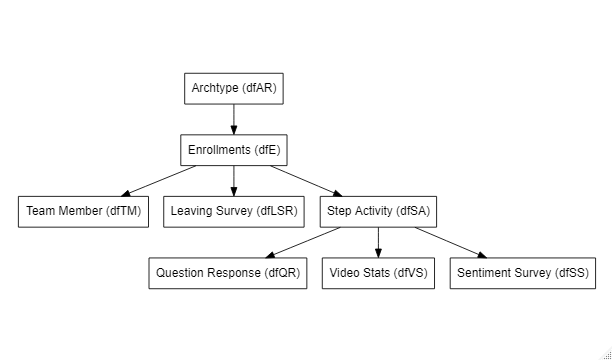

```{r setup, include=FALSE}
knitr::opts_chunk$set(echo = TRUE)
knitr::opts_knit$set(root.dir=normalizePath('..'))
```

```{r loadproject, include=FALSE}
library(ProjectTemplate); load.project()
```

## CSC 8631 - Data Investigation with Student Data

### Introduction
This report is an investigation of Student Data using the CRISP-DM model. The model is iterative and so this report covers two iterations, including the processes of Business Understanding, Data Understanding, Data Preparation. The subprocesses I've chosen are to do the following steps: 

* Import
* Tidy
* Visualise
* Understand 
* Communicate

The project has been set up using ProjectTemplate to provide structure and repeatability, which will be tested on a regular basis. Version control is provided by Git and this report created with R Markdown. Various libraries have been imported and used from the Tidyverse regarding data import and management (Dplyr, Readr) and visualisation (GGPlot2).

## Iteration 1
Iteration 1 was be used to investigate the data and generate a hypothesis for further investigation going through the steps outlined above. Once a hypothesis has been identified this will be further investigated in iteration 2. An initial investigation into each relation in the dataset will be carried out and a graphical summary will be presented with potential hypothesis and further analysis will be carried out on iteration 2. Once we have a working hypothesis summary statistics of the specific data to be used will be presented. 

### 1 - Import, Tidy
The data was supplied in csv files covering 8 different areas of the software over multiple stages, this was imported into R into 8 data frames from the original for easier analysis. The number of the file was included to give an indication of which stage of the course the data was created which will potentially provide an indication of time for further analysis. Upon initial import is was found that the detected data types were not consistent and so the import_csv functionality in ReadR was used, which allowed me to dynamically set the property type on import. Particularly any ID property was set to be an integer and Date time properties we converted to the local POSIX time format.

As a first step, once the data had been imported i reviewed the summary of each dataframe and created an Entity Relationship Diagram (ERD) as shown in figure 1, using a package called DiagrammR. Unfortunately this hasn't allowed me to put the detail of each relationship on.

{width=75%}

It was found that some table had primary keys called ID (Archetype, Leaving Survey Responses, Sentiment Survey,) Learner_ID (Enrollments, Question Responses, Step Activity, Team Member ) or Step_Position (Video Stats). It was regarded that these would be the candidate keys for the initial investigation in Iteration 1. The data regarding video views was video centric and did not have Learner ID nor did the sentiment survey data. 

Upon investigation of the data it was decided that further investigation of Enrollments, Step Activity, Leaving Survey Responses, Question Response, Video Stats and Weekly Sentiment Surveys may yield an interesting topic for investigation. The other data was dismissed due to its limited breath. The Team Member dataframe would allow getting a students name if required, however, this has been blanked out in this dataset as per Information Governance laws.

### 2 Visualise and Understanding
Each data frame was investigated with a combination of viewing the data, frequency tables and graphical analysis. Each table identified above will be visualised and some conclusions regarding potential investigation drawn. A comment will be provided on the contents of each table in terms or items, variables and variable types, namely continuous and categorical. Appropriate visualisations for the variable types will be selected. Also an outline of any feature engineering (i.e. the derivation of new data items) carried out will be included. The investigation will follow the order of the ERD in figure 1 and start with Enrollments, then Leaving Survey and Step Activity, then consider the layer below that.

The enrollments dataset is a categorical dataset with n=37296 items and p=14 variables. For each variable bar plots were used to visualise the spread of values of the data. The properties investigated were Country, Gender, Age Range, Highest Education Achieved, Employment Area and Employment Status. The data set was grouped by each variable in turn and a then the enrollments counted. Specifically for the country visualisation, the dataset was filtered to only return those with more than 100 enrollments. The output for each property can be seen in Figure 2.

```{r enrollmentPlots, echo=FALSE, out.width="100%", fig.cap="Enrollment data frequency by property"}

par(mfrow=c(2,3))
#graph the enrollment data

#country
countryData = dfE %>%
  group_by(country) %>%
  count(dfE$country) #do a count
countryData = filter(countryData, n > 100) #filter only where greater than 100
countryData = select(countryData, country, n) #select the correct cols
barplot(countryData$n, main="Country",
        names.arg = c("Australia", 'GB', "India", "Nigeria", "Unknown", "US")
        , xlab = "Country"
        , ylab="Count of Enrollments")
#pie(countryData$n, labels = countryData$country, main="Enrollments by country greater than 10")

#gender
genderData = dfE %>%
  group_by(gender) %>%
  count(dfE$gender)
genderData = select(genderData, gender, n)
barplot(genderData$n, main="Gender",
        names.arg = c("Female", 'Male', "Nonbinary", "Other", "Unknown")
        , xlab = "Gender"
        , ylab="Count of Enrollments")
#pie(genderData$n, labels = genderData$gender, main="Enrollments by gender")

#age range
agerangeData = dfE %>%
  group_by(age_range) %>%
  count(dfE$age_range)
agerangeData = select(agerangeData, age_range, n)
barplot(agerangeData$n, main="Age Range",
        names.arg = c("<18", ">65", "18-25", "26-35", "36-45", "46-55", "56-65","Unknown")
        , xlab = "Age Range"
        , ylab="Count of Enrollments")

#highest_education_level
highestEducationData = dfE %>%
  group_by(highest_education_level) %>%
  count(dfE$highest_education_level)
highestEducationData = select(highestEducationData, highest_education_level, n)
barplot(highestEducationData$n, main="Highest Education",
        names.arg = c("Apprenticeship", "<Secondary", "Professional", "Secondary", "Tertiary", "Degree", "Doctrate", "Masters", "Unknown")
        , xlab = "Highest Educational Level"
        , ylab="Count of Enrollments")

#employment area
employmentareaData = dfE %>%
  group_by(employment_area) %>%
  count(dfE$employment_area)
employmentareaData = select(employmentareaData, employment_area, n)
barplot(employmentareaData$n, main="Employment Area",
        names.arg = employmentareaData$employment_area
        , xlab = "Employment Area"
        , ylab="Count of Enrollments")

#employment area
employmentstatusData = dfE %>%
  group_by(employment_status) %>%
  count(dfE$employment_status)
employmentstatusData = select(employmentstatusData, employment_status, n)
barplot(employmentstatusData$n, main="Employment Status",
        names.arg = employmentstatusData$employment_status
        , xlab = "Employment Status"
        , ylab="Count of Enrollments")

par(mfrow=c(1,1))
 
```
It was identified that the vast majority of records for each property was "Unknown", therefore there isn't the scope of data to support an investigation. Potentially this is an avenue to improve data completeness in future enrollments.

Related to the Enrollments data frame are Leaving Surveys and Step Activity. The leaving survey responses comprises of categorical, character and date based data regarding feedback from individuals which have left the course. The data frame has n=403 items and p=10 variables. The data frame has Learner_ID which can be used to relate to Enrollments as well as a "Last Complete Step" property with relates to the Activity Step data frame. This allows us to identify the step at which students leave the course, once the NA has been filtered out.

```{r leaversByLastCompleteStep, echo=FALSE, out.width="65%", fig.cap="Leavers by Step of Course"}
  dfLSR = dfLSR %>% filter(!is.na(last_completed_step))
  
  #percentage complete
  ggplot(data = dfLSR, aes(x = last_completed_step)) +
    geom_bar() +
    labs(y="Count of Leavers", x = "Step Number") + 
    theme_bw() + 
    scale_fill_brewer(palette="PuBu") +
    theme(axis.text.x = element_text(angle = 90))
```

You can see that most leave the course after step 3.20 which could potentially be investigated. Further investigation the reason for leaving had multiple categories referring to the lack of time so all reasons that mentioned time were grouped as one to make it comparable with the other reasons. This is shown in Figure 4 below.

```{r leaversByReason, echo=FALSE, out.width="65%", fig.cap="Leavers by Reason"}

barplot(table(dfLSR$reason)
        , main="Reasons for Leaving"
        , xlab="Reason"
        , ylab="Count of Leavers")
  
```

It can be seen that the principal reason for leaving is lack of time.

The next related dataset to the enrollment data is the step activity data. This indicates the stage in the course that the related data occurred at. It is principally categorical data with n=423072 items and p=7 variables, although two more were subsequently added after feature engineeering. 

The data includes the step number, the step start and end date with the learner_id. The end date has been used to indicate whether a step was complete for that student and how long the step took, this has resulted in 2 new columns - "isComplete" flag and "completedTime" in days, and allows us to calculate step completion stats and time scales per step as per below.

```{r stepActivityPlot, echo=FALSE, out.width="100%", fig.cap="Step Activity Exploration"}

par(mfrow=c(3,2))

#plot complete or not
barplot(table(dfSA$isComplete), ylim=c(0, 400000) 
        , main="Total Completed Steps"
        , xlab="Complete"
        , ylab="Count of Activity Steps")

boxplot(dfSA$step ~ dfSA$isComplete
        , main="Activity vs Step Number"
        , xlab="Complete"
        , ylab="Step Number")

boxplot(as.numeric(dfSA$timeToComplete) ~ as.numeric(substring(dfSA$step,1,3))
        , main="Time to Complete by Step"
        , xlab="Step"
        , ylab="Number of days")

barplot(table(dfSA$stage_id) 
        , main="Total Completed Steps by Course Stage"
        , xlab="Stage"
        , ylab="Complete steps")

boxplot(as.numeric(dfSA$timeToComplete) ~ dfSA$stage_id
        , main="Time to Complete by Course Stage"
        , xlab="Stage"
        , ylab="Number of days")

par(mfrow=c(1,1))


```

We can see that there are far more completed steps than incomplete, and that incomplete steps are generally earlier in the course. However, there are still students who complete early steps and subsequently fail to complete later ones. There also indicates a wide spread of time to complete each step, with a variance of 103.1396. An outlier of this is *Step 2.8* which takes everyone very few days to complete.

Due to adding the stage of the course we can also see that the time to complete each unit reduces as the course wears on, as does the number of students that complete each step.

The addition of the feature engineered values gives us the potential to use this dataset in further analysis. There is potential to look at incomplete steps in relation to course leavers, and investigate the short completion times of step 2.8.

Each step in the step activity data frame has associated quiz questions and responses. This is stored in the questions data frame. The question responses data is categorical data with n=176463 items and p=12 variables after the feature engineeering outlined below. The question responses table has the quiz question which includes the step number. Feature engineering was carried out to extract the correct step number and add it to a column, should there be a need to relate to the the activity steps.

An examination of the data was carried out to look at the volume of responses.

```{r plotQuestionResponses, echo=FALSE, out.width="65%", fig.cap="Quiz Question Responses"}

answerCount = dfQR %>%
  group_by(quiz_question) %>%
  count(dfQR$response)
answerCount = select(answerCount, quiz_question, n)

#responses by question
barplot(answerCount$n
        , main="Count of Responses by Question"
        , xlab="Question"
        , ylab="Count")
  
```

As we can see there are significant differences in number of times each question was answered over the length of the course and the as expected mix of correct and incorrect answers. There is the potential here to look into the mix of correct and incorrect answers, potentially investigating any relationship between low attainment on the quizzes throughout the course to the student subsequently leaving.

Each step in the step activity data frame also has associated video view data. The video stats data is multivariate data with n=65 items and p=29 variables. There are significantly more data variables in this relation then in those examined previously, and significantly less data items. 

The data in this relation can be subsetted into data pertaining to percentage complete, type of device and location of the video view, so three data sets were created with just this data present. Some work was then done to convert the data from percentages to raw numbers, and then to pivot the result to allow some insights into the number of views.

It can be seen below that the number of views which watched the whole video dropped off as they viewer got further through. For example we can see for the first video "1.1. Welcome to the course" that 1500 views completed 5% of the video, which drops to 1200 who completed 100%. This is then presented for each video throughout the course.

```{r plotVideoStats, echo=FALSE, out.width="50%", fig.cap="Video View Completions"}

  #render number of views by percent complete
  ggplot(data = dfVSTotalsPivot, aes(fill=percentviewed, y = count, x = as.character(step_position))) +
    geom_bar(stat="identity", position="dodge") +
    labs(title= "Views by Video Completion", y="Views", x = "Video") + 
    scale_fill_brewer(palette="PuBu", name="Viewed",
                      breaks=c("05", "10", "25" ,"50","75","95", "99"),
                      labels=c("5%", "10%", "25%" ,"50%","75%","95%", "100%")) +
    theme_bw() + 
    theme(axis.text.x = element_text(angle = 90))

```

It can be seen that as the course progresses the volume of students engaging with each video reduces reasonably significantly other than "1.5 Privacy online and offline" It can also be seen that some videos see a significant drop between 95% and 100% completion.

When viewing views by device it can be seen that no video was viewed on a tablet or TV, all views were by Console, Desktop or Mobile. It can be seen that by far the majority of views were on a Console throughout the length of the course, so it may be concluded the videos should be designed to play best on a console.

```{r plotVideoDevice, echo=FALSE, out.width="50%", fig.cap="Video View by Device"}
  #video by device
  ggplot(data = dfVSDevicePivot, aes(fill=percentviewed, y = count, x = as.character(step_position))) +
    geom_bar(stat="identity", position="dodge") +
    labs(title= "Views by Device", y="Views", x = "Video") + 
    theme_bw() + 
    scale_fill_brewer(palette="PuBu", name="Device") +
    theme(axis.text.x = element_text(angle = 90))
```

The data shown reflects the same changes in the volume of use as shown above, i.e. that "1.5 Privacy online and offline" shows an increase in views in an otherwise downward trend.

By viewing views by location it can be seen that the majority of views are from Europe with non at all from Antarctica and few from North America, Oceania and South America.

```{r videoByLocation, echo=FALSE, out.width="50%", fig.cap="Video View by Location"}
  #video by location
  ggplot(data = dfVSLocationPivot, aes(fill=percentviewed, y = count, x = as.character(step_position))) +
    geom_bar(stat="identity", position="dodge") +
    labs(title= "Views by Location", y="Views", x = "Video") + 
    scale_fill_brewer(palette="PuBu", name="Location") +
    theme_bw() + 
    theme(axis.text.x = element_text(angle = 90))
```
The data shown reflects the same changes in the volume of use as shown above, i.e. that "1.5 Privacy online and offline" shows an increase in views in an otherwise downward trend.

There is potential to link views with stages and we could potentially look at leavers by location and device by using this view data along with the leaver survey responses. We could also look at test performance related to video completion, location or devices.

The final data frame related to the course stage is the weekly sentiment data, this is completed by each student per week. The sentiment data has n=181 items and p=6 variables. This table has a categorical properly rating and character data to cover the sentiment. I will not be looking to cover sentiment analysis in this work so only the categorical value will be looked at.

As we can see from the weekly experience data below, across the three weeks of the course the total sentiment data provided by the student cohort went down from 73 to 45, although the experience ratings being provided remained consistent at approximately 90% providing a rating of 3.

```{r plotSentimentAnalysis, echo=FALSE, out.width="65%", fig.cap="Sentiment Completions"}

ggplot(dfSS, aes(x=week_number, fill=factor(experience_rating))) + 
  geom_bar(position="stack") +
  labs(title= "Weekly Experience Rating", y="Count", x = "Week Number") +
  theme_bw() + 
  scale_fill_brewer(palette="PuBu", name="Experience Rating")

```
It would be of value to understand this data as a percentage of the total patient cohort. Given the lack of a "learner_id" in this data it isn't immediately possible to relate the sentiments back to a specific learner, so this data could only be looked into by step. There may be value in understanding after which step students decided to stop providing feedback, this could be related on the "stage_id".

### 3 Conclusion and Hypothesis
There is a wide breath of data in the data set regarding activity throughout the course, and richness is provided by the video views data frame which includes data such as the device used, location of the student and so forth. The use of the step dataset allows us to investigate the stage of the course which events happened, and the leavers dataset allows us to look into leavers. Knowing that the location work has been completed previously by other students, I feel that there is enough data to investigate something around student performance, stage and the decision to leave.

I hyptothesise that the lower completion of videos and lower weekly sentiment scores increase the chances of a student choosing to leave the course. This will be investigated in iteration 2 of the CRISP-DM model.


#### Iteration 2 Hypothesis
Test performance vs video views vs leavers

## Iteration 2
Iteration 2 will further investigate the hypothesis identified in iteration 1 and will present the findings.

Location Analysis
Multivariate Analysis
GGPlot2


### Findings
To answer the hypothesis XYZ the findings are that ABC

## Conclusion

## References
ReadR - https://readr.tidyverse.org/index.html
DiagrammeR - https://rich-iannone.github.io/DiagrammeR/
Working with categorical data - https://cran.r-project.org/web/packages/vcdExtra/vignettes/vcd-tutorial.pdf 

## R Markdown

This is an R Markdown document. Markdown is a simple formatting syntax for authoring HTML, PDF, and MS Word documents. For more details on using R Markdown see <http://rmarkdown.rstudio.com>.

When you click the **Knit** button a document will be generated that includes both content as well as the output of any embedded R code chunks within the document. You can embed an R code chunk like this:

```{r cars}
summary(cars)
```

## Including Plots

You can also embed plots, for example:

```{r pressure, echo=FALSE}
plot(pressure)
```

Note that the `echo = FALSE` parameter was added to the code chunk to prevent printing of the R code that generated the plot.
