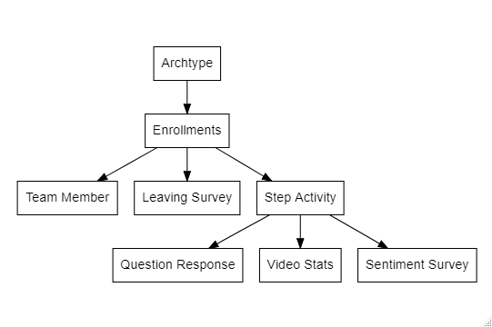

```{r setup, include=FALSE}
knitr::opts_chunk$set(echo = TRUE)
knitr::opts_knit$set(root.dir=normalizePath('..'))
```

```{r loadproject, include=FALSE}
library(ProjectTemplate); load.project()
```

## CSC 8631 - Data Investigation with Student Data

### Introduction

Report into investigation of Student Data using the CRISP-DM model. This report covers two iterations of the model and includes the processes of Business Understanding, Data Understanding, Data Preparation. The subprocesses I've chosen are to do the following steps:

* Import
* Tidy
* Visualise
* Understand 
* Communicate

The project has been set up using ProjectTemplate to provide some structure and repeatability, which will be tested on a regular basis. Version control is provided by Git and this report created with R Markdown.

## Libraries

* ReadR - library to provide extra functionality to import the data from CSV. In this case it allows me to import the data and assign type.
* DiagrammeR - used to create a simple entity relationship diagram to focus the initial data understanding step.
* DplyR - library to provide easier data management.

## Relationships
The data was investigated to reveal no primary keys, however columns such as learner_id could be used to create local relationships. The initial table structure has been envisaged as per below.



Each relation was also investigated for potential primary keys, and those that didn't have one had one created using the row_id

## Iteration 1
Iteration 1 was be used to investigate the data and generate a hypothesis for further investigation going through the steps outlined above. Once a hypothesis has been identified this will be further investigated in iteration 2.

### 1 - Import and Tidy
The data was imported into R using Readr into 8 data frames from the original csv files, for easier analysis. The initial data sets were split out by dataset number which resulted in too many separate data frames to investigate. This step was done using ProjectTemplate's munge functionality. Due to the fact that the detected data types were not consistent the following data manipulation was carried out. 

* ID - to integer
* Date time - to the local POSIX date time format

The number of each file was added to the data frame as "stage_id"  to give an indication of which stage in the course the record was created at.

Initial exploration of the data indicated that Learner_Id was a candidate for relating 6 of the 8 data frames as it was a common column, the data regarding video views was video centric and did not have learner id nor did the sentiment survey data.

### 2 Visualise
Each data frame was investigated with a combination of viewing the data, creation of barplots and frequency tables. The data investigated was principally about Enrollments, Results, Leavers and Video Views. This was an attempt to find some interesting data to analyse, however, a lot of the investigation returned the majority of the data being unknown. For example, in the Enrollments data barplots of data items such as Country, Age Range, Employment returned the majority of the data was unknown as per below.

```{r countryBoxPlot, echo=FALSE}
  plot.enrollments()
```

### 3 Understand

## Iteration 2
Iteration 2 will further investigate the hypothesis identified in iteration 1 and will present the findings.

### Findings
To answer the hypothesis XYZ the findings are that ABC

## Conclusion

## References
ReadR - https://readr.tidyverse.org/index.html
DiagrammeR - https://rich-iannone.github.io/DiagrammeR/
Working with categorical data - https://cran.r-project.org/web/packages/vcdExtra/vignettes/vcd-tutorial.pdf 

## R Markdown

This is an R Markdown document. Markdown is a simple formatting syntax for authoring HTML, PDF, and MS Word documents. For more details on using R Markdown see <http://rmarkdown.rstudio.com>.

When you click the **Knit** button a document will be generated that includes both content as well as the output of any embedded R code chunks within the document. You can embed an R code chunk like this:

```{r cars}
summary(cars)
```

## Including Plots

You can also embed plots, for example:

```{r pressure, echo=FALSE}
plot(pressure)
```

Note that the `echo = FALSE` parameter was added to the code chunk to prevent printing of the R code that generated the plot.
